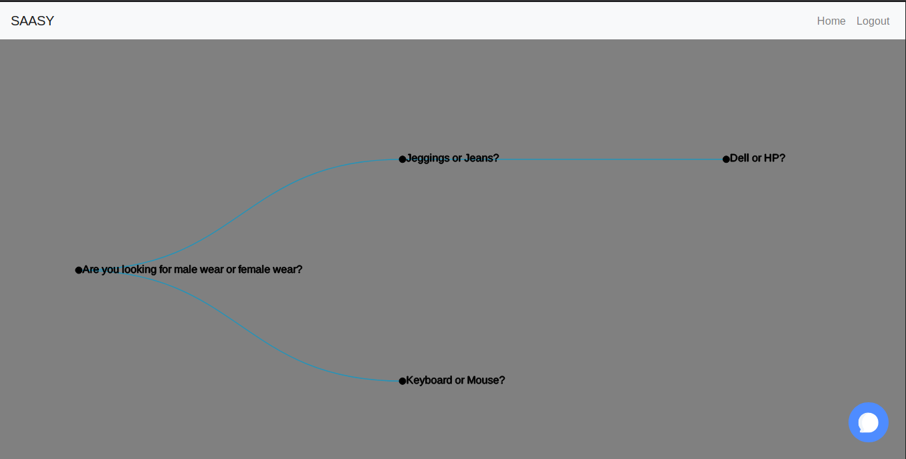
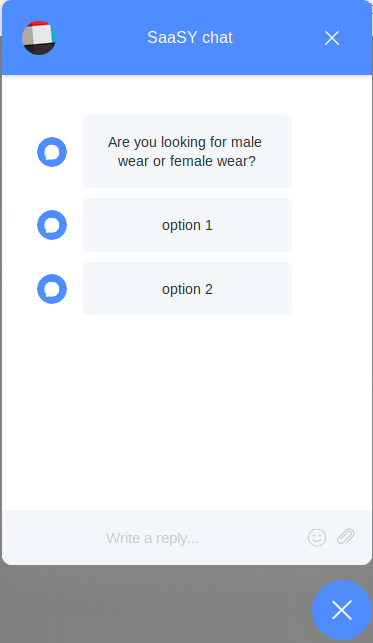

# SASSY by Bubblegum

Companies (typically early-stage startups) need to make their product pages more interactive to help users find what they’re looking for. 

Such companies usually have very busy developers, and would rather delegate this mundane task to low-level marketing staff. 

The problem we address is therefore: *how do we make designing decision-tree-based chatbots simple enough for someone with no technical background?*
.

# High Level Solution
A user-friendly website that allows non-engineering professionals to quickly design a decision-tree-based chat system to lead end users to a better product. 

Our immediate user (the company’s staff, not the end user) can maintain multiple projects, visualise their tree, and perform CRUD operations on the nodes. 

Whether the nodes contain further questions or final options is entirely up to our users.

# Usage
A user can login using their credentials and enter the dashboard which looks like . 

On clicking the chat window, you can see what the end user product will look like based on the tree. It looks like this 

To add more nodes, click on a particular node to add more children. On clicking a node, a modal will popup showcasing it's children and their id's. Click on the modify button to add/delete nodes. 
* To add a node then enter the question and press `Add`.
* To delete copy the id of the node you want to delete and enter in the input box and press `Delete`.

# Endgoal
The tree will populate the chat window where you can choose whichever option you want and then traverse accordingly.

As of right now the chat-window is static and keep on the lookout for updates to this.

## Links
* [Code](src/)
* [Documentation]()
* [Website]()

## Roadmap

- [X] Login Page
- [ ] NavBar
- [X] Modal Add/delete options
- [X] TreeView
- [ ] ChatBox

## Dependencies

1. d3.js
2. reactstrap
3. react-chat-window
4. react-tree-graph
5. axios
6. firebase
7. react-router-dom

## Developers
* [@nair-ayush](https://github.com/nair-ayush/)
* [@kanishk98](https://github.com/kanishk98/)
* [@padiboi](https://github.com/padiboi/)
## Contributing

Fork this repo and checkout to new branch off the `develop` branch. `master` for now shows the standard react view from `create-react-app`

This project was bootstrapped with [Create React App](https://github.com/facebook/create-react-app).

## Available Scripts

### npm start
Runs the app on the `localhost:3000` and use the app there after. The actual command is `react-scripts-start`. Check out `package.json` to see the other scripts;
